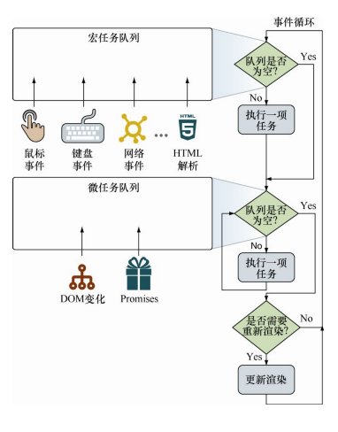

## `this` keyword

- 只要是作为函数调用，那么它的 `this` 指向的就是 `windows`，如果是在`use strict`模式下，`this`是 `undefined`
- 如果将一个函数作为对象的方法进行调用，那么这个方法的`this`就会指向对象本身

---

- 如果构造函数返回一个对象，则该对象将作为整个表达式的值返回，而传入构造函数的`this`将被丢弃
- 如果构造函数返回的是非对象，则忽略返回值，返回新创建的对象

---

- 在全局代码中定义对象字面量，在字面量中定义箭头函数，那么箭头函数内的`this`指向全局对象`windows`

## Inheritance

- 每个对象都含有原型的引用，当查找属性时，如果该对象本身没有，就会去原型上查找（所以可以形成原型链）
- 原型是对象的内置属性，使用标记`[[prototype]]`
- 可以通过 `setPrototypeOf` 设置原型

---

- 每个函数都有一个原型对象
- 每个函数的原型都有一个 `constructor` 属性，指向函数本身（`new Ninja().constructor === Ninja`）
- 重新赋值 `prototype` 会导致`constructor`异常 （`Ninja.prototype = new Person`），可以通过 `defineProperty` 修复（重新定义 `constructor`）

---

- 对象与函数原型之间的引用关系实在对象创建时建立的：创建实例之后再修改构造函数的原型链，实例指向的仍然是旧的原型链

---

- `instanceOf` 本质上你检测右边的函数原型是否存在于左边对象的原型链上
-  JavaScript 语言是动态的，如果创建实例之后再修改构造函数的原型链，那么检测结果可能会出问题

---

- `Object.create()` 方法创建一个新对象，使用现有的对象来提供新创建的对象的原型：`MyClass.prototype = Object.create(SuperClass.prototype)`

## `Map`

- Map 的 key 不一定是字符串，但 `Object` 的 key 必须是字符串

## Event

事件分为“宏事件”和“微事件”，如下图所示：单次循环迭代中，最多处理一个宏任务（其余的在队列中等待），而队列中的所有微任务都会被处理。

单次循环迭代中，最多处理 一个宏任务（其余的在队列中等待），而队列中的所有微任务都会被处理。

---

计时器提供一种异步延迟执行代码片段的能力，至少要延迟指定的毫秒数。因为JavaScript单线程的本质，我们只能控制计时器何时被加入队列中，而无法控制何时执行。

明显，setTimeout内的代码在前一个回调函数执行完成之后，至少延迟10ms执行（取决于事件队列的状态，等待时间只会大于10ms）；而setInterval会尝试每10ms执行回调函数，不关心前一个回调函数是否执行。从上一节的例子中可以看到，间隔执行函数可以一个接一个地依次执行。

---

已经知道一个事件可以触发多次事件处理器的执行，每个事件处理器可以是捕获或冒泡模式。因此，事件首先通过捕获，从顶部元素传递到目标元素。

---

this关键字指向被绑定事件处理函数的元素，而event.target属性指向事件发生的元素。
