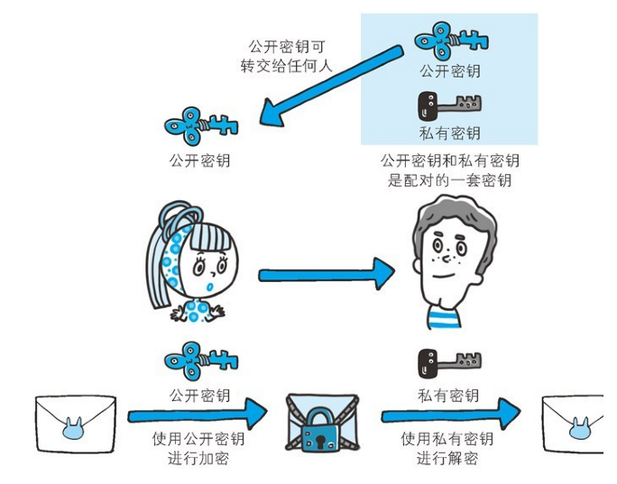
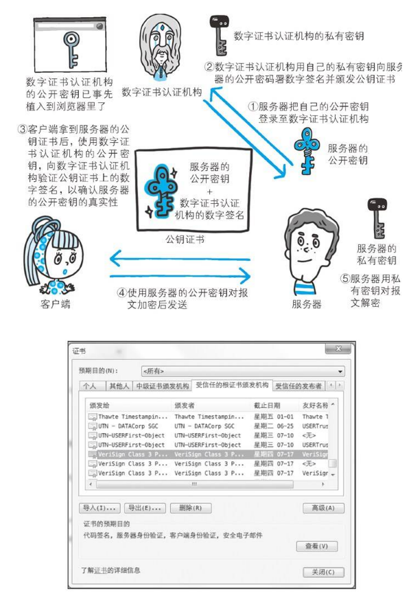

-IP协议的作用是把各种数据包传送给对方。而要保证确实传送到对方那里，则需要满足各类条件。其中两个重要的条件是IP地址和MAC 地址（ Media Access Control Address）。

- 问题，HTTP/1.1和一部分的HTTP/1.0想出了持久连接（HTTP Persistent Connections，也称为HTTPkeep-alive或HTTPconnectionreuse）的方法。持久连接的特点是，只要任意一端没有明确提出断开连接，则保持TCP连接状态。

## HTTP 状态码
  - **204 No Content**: 该状态码代表服务器接收的请求已成功处理，但在返回的响应报文中不含实体的主体部分。另外，也不允许返回任何实体的主体。比如，当从浏览器发出请求处理后，返回204响应，那么浏览器显示的页面不发生更新。**一般在只需要从客户端往服务器发送信息，而对客户端不需要发送新信息内容的情况下使用。**
  - **304 Not Modified**: 该状态码表示客户端发送附带条件的请求时(If-Match, If-Modified-Since, If-None-Match, If-Range, If-Unmodified-Since)，服务器端允许请求访问资源，但未满足条件的情况。304状态码返回时，不包含任何响应的主体部分。304虽然被划分在3XX类别中，但是和重定向没有关系。

- 网关: 网关是转发其他服务器通信数据的服务器，接收从客户端发送来的请求时，它就像自己拥有资源的源服务器一样对请求进行处理。有时客户端可能都不会察觉，自己的通信目标是一个网关。

## HTTPS

- HTTPS
  - HTTPS并非是应用层的一种新协议。只是HTTP通信接口部分用SSL（Secure Socket Layer）和TLS（Transport Layer Security）协议代替而已。
  - 通常，HTTP 直接和 TCP 通信。当使用 SSL 时，则演变成先和 SSL 通信，再由 SSL 和 TCP 通信了。简言之，所谓HTTPS，其实就是身披 SSL 协议这层外壳的 HTTP。
  - HTTPS 采用共享密钥加密和公开密钥加密两者并用的混合加密机制。若密钥能够实现安全交换，那么有可能会考虑仅使用公开密钥加密来通信。

### 公开密钥加密原理

公开密钥加密方式还是存在一些问题的。那就是无法证明公开密钥本身就是货真价实的公开密钥。比如，正准备和某台服务器建立公开密钥加密方式下的通信时，如何证明收到的公开密钥就是原本预想的那台服务器发行的公开密钥。或许在公开密钥传输途中，真正的公开密钥已经被攻击者替换掉了。

为了解决上述问题，可以使用由数字证书认证机构（CA，CertificateAuthority）和其相关机关颁发的公开密钥证书。数字证书认证机构处于客户端与服务器双方都可信赖的第三方机构的立场上。威瑞信（VeriSign）就是其中一家非常有名的数字证书认证机构。我们来介绍一下数字证书认证机构的业务流程:
  - 首先，服务器的运营人员向数字证书认证机构提出公开密钥的申请。
  - 数字证书认证机构在判明提出申请者的身份之后，会对已申请的公开密钥做数字签名，然后分配这个已签名的公开密钥，并将该公开密钥放入公钥证书后绑定在一起。
  - 服务器会将这份由数字证书认证机构颁发的公钥证书发送给客户端，以进行公开密钥加密方式通信。公钥证书也可叫做数字证书或直接称为证书。
  - 接到证书的客户端可使用数字证书认证机构的公开密钥，对那张证书上的数字签名进行验证，一旦验证通过，客户端便可明确两件事：一，认证服务器的公开密钥的是真实有效的数字证书认证机构。二，服务器的公开密钥是值得信赖的。
  - 此处认证机关的公开密钥必须安全地转交给客户端。使用通信方式时，如何安全转交是一件很困难的事，因此，多数浏览器开发商发布版本时，会事先在内部植入常用认证机关的公开密钥。

